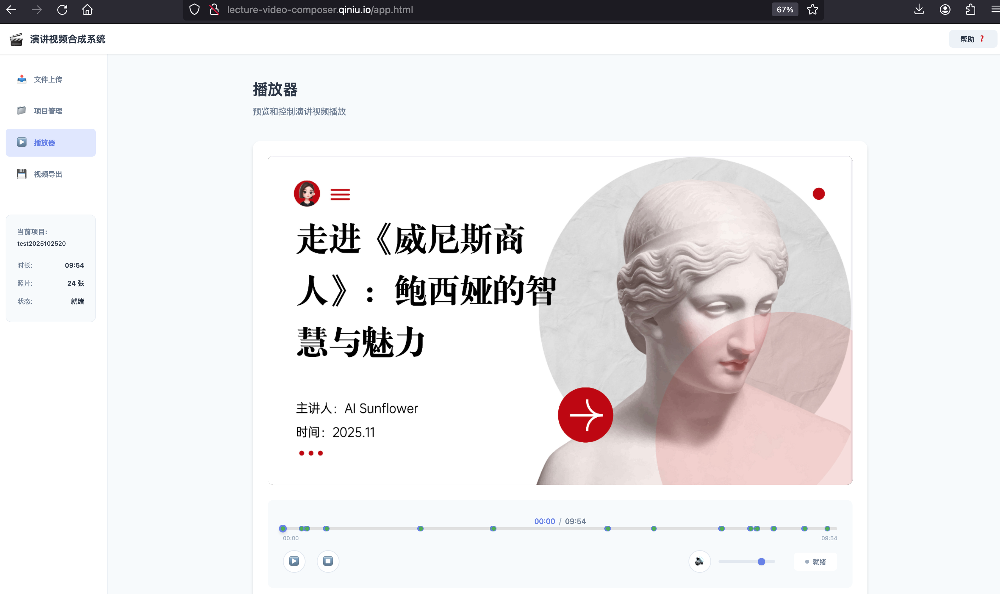
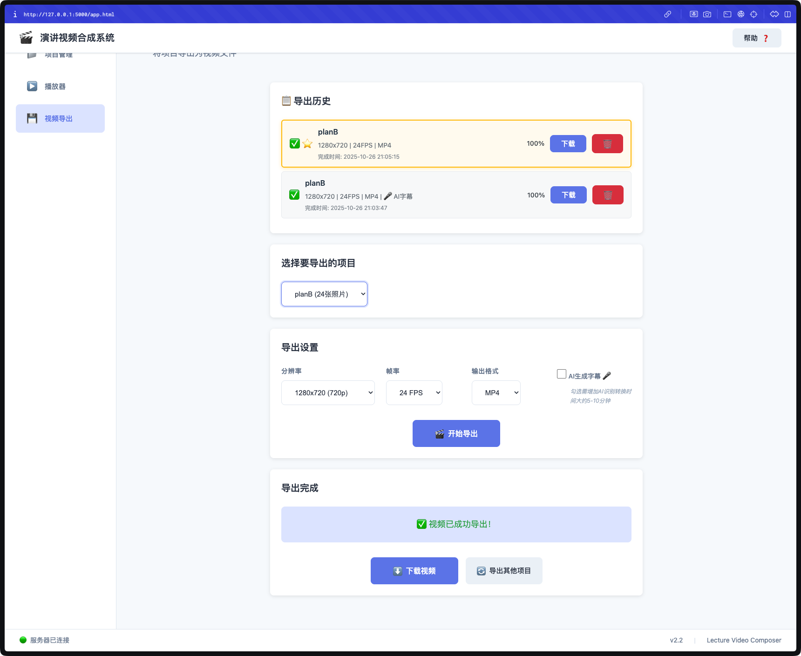
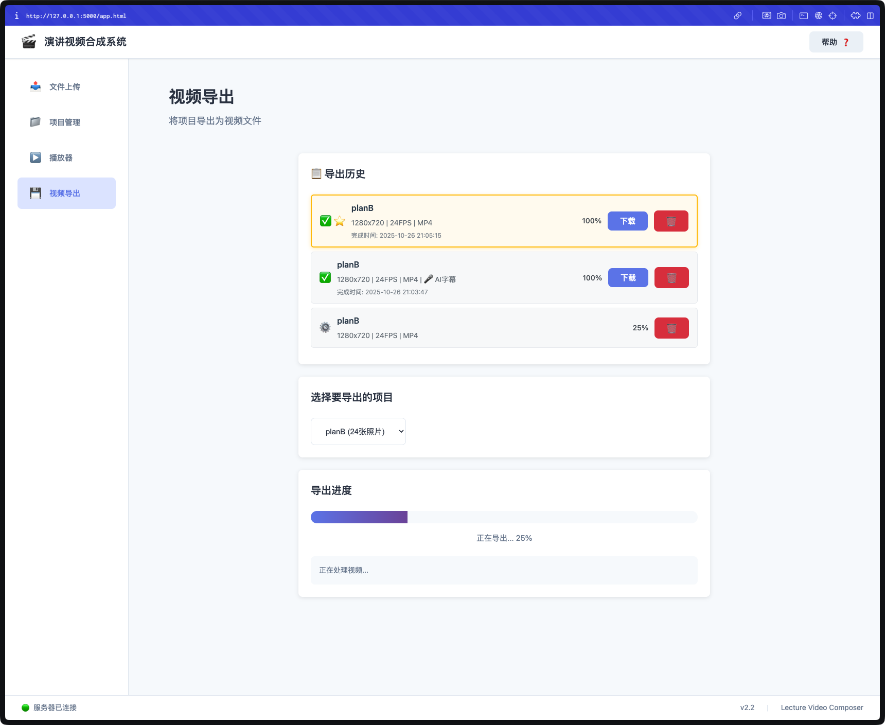

# 🌻 Sunflower队 - lecture-video-composer演讲视频合成系统

> 七牛云第四届内部 Hackathon 参赛项目
> **让每一场演讲都值得被记录、被回放、被分享**

[](https://github.com/Qiniu-ERE/Sunflower)
[](https://www.python.org/)
[](./LICENSE)
---

## 📖 项目背景

在 AI 浪潮席卷全球的今天，我们正站在技术演进的关键节点。本项目响应七牛云第四届内部 Hackathon 的号召，用 AI 赋能的思维，重新定义演讲记录与回放体验，从客户需求出发从而创造更多价值。


## 🎯 Hackathon 选题

**演讲视频合成**

- 用户在听演讲时录制声音，并不定期拍摄演讲内容（如PPT、板书）
- 声音文件和照片以文件创建时间命名：`YYYY-MM-DD-hh:mm:ss.ext`
- 根据时间戳智能合成演讲视频，或实现类似视频的播放效果
- 存储优化：相比完整视频减少 70%+ 存储空间

### 💡 核心理念

**问题**：传统录屏方式占用空间大，纯音频记录缺乏视觉信息  
**方案**：音频 + 照片的轻量级方式，合成具有视觉效果的演讲回放  
**创新**：基于时间戳的智能同步，让每一帧画面与声音完美契合

---

## ✨ 核心特性

- 🎯 **轻量化存储** - 相比传统录屏节省 80%+ 存储空间
- 🚀 **操作简便** - 只需录音+拍照，无需连续录像
- ⚡ **实时播放** - 基于时间轴的音画自动同步
- 🎬 **智能字幕** - AI 语音识别自动生成字幕
- 📦 **视频导出** - 支持 720p/1080p MP4 输出
- 🌐 **Web 界面** - 现代化的浏览器操作体验

## 💰 商业价值
- **[商业企划书](./docs/商业企划书.md)** - 市场分析、商业模式、融资计划 🔥

---

## 🎬 效果展示

<!-- 演示视频 -->
### 📹 演示视频

https://github.com/user-attachments/assets/6ab6b1be-f2cf-477e-99e1-f4ff78ac36c3

> 💡 **说明**：GitHub 需要将视频上传到 Issue 或 PR 评论中才能获取可嵌入的链接。  
> **临时方案**：[点击此处观看演示视频](http://rzkkr9sg3.hd-bkt.clouddn.com/test_tools/039f854e886ae45cc4947318ba4b9dfa.mov)


**视频内容：**
- 文件上传与项目创建流程
- 实时播放器操作演示
- 时间轴精确控制
- 视频导出功能展示

<!-- 界面截图 -->
### 🖼️ 界面预览

<table>
  <tr>
    <td><br/><center>产品主页入口</center></td>
    <td><br/><center>文件上传</center></td>
  </tr>
  <tr>
    <td><br/><center>项目管理</center></td>
    <td><br/><center>实时播放</center></td>    
  </tr>
  <tr>
    <td><br/><center>时间轴控制</center></td>
    <td><br/><center>视频导出配置</center></td>
  </tr>
  <tr>
    <td><br/><center>导出进度追踪</center></td>
    <td><br/><center>导出完成下载</center></td>
  </tr>
  <tr>
    <td colspan="2"><br/><center>帮助中心</center></td>
  </tr>
</table>


---

## 🚀 快速开始

### 环境要求

- Python 3.8+
- FFmpeg（视频导出必需）
- 现代浏览器（Chrome/Firefox/Safari）

### 安装运行

**1. 安装 FFmpeg**

```bash
# macOS
brew install ffmpeg

# Ubuntu/Debian
sudo apt-get update
sudo apt-get install ffmpeg

# CentOS/RHEL
sudo yum install ffmpeg

# openEuler 20.03/22.03 LTS
sudo dnf install ffmpeg

# Windows
# 下载安装包: https://ffmpeg.org/download.html
# 并将 ffmpeg.exe 添加到系统 PATH
```

**2. 安装 Python 依赖**

```bash
# 克隆项目
git clone https://github.com/Qiniu-ERE/Sunflower.git
cd Sunflower/lecture-video-composer

# 安装 Python 依赖（请使用 Python 3.8+）
pip3 install -r requirements.txt
# 或者使用：python3 -m pip install -r requirements.txt
```

**3. 启动服务**

```bash
# 启动 Web 服务
python3 run_web.py

# 浏览器打开：http://127.0.0.1:5000
```

> **注意**：本项目需要 Python 3.8 或更高版本。如果系统中 `python` 命令指向 Python 2.x，请确保使用 `python3` 和 `pip3` 命令。

### 基本使用

1. **上传文件** - 拖拽音频（MP3/WAV）和照片（JPG/PNG）到上传区
2. **创建项目** - 系统自动解析时间戳并生成时间轴
3. **播放预览** - 实时同步播放音频和照片切换
4. **导出视频** - 配置参数并导出 MP4 视频（开发中）

> **文件命名规范**：`YYYY-MM-DD-HH:MM:SS.扩展名`（如：`2025-10-24-15:30:45.jpg`）

---

## � 项目结构

```
Sunflower/
├── README.md                           # 项目总览（本文件）
├── docs/                               # 顶层文档目录
│   ├── PRD_演讲视频合成系统.md         # 产品需求文档
│   └── implementation_plan.md          # 实施计划文档
│
└── lecture-video-composer/             # 核心项目目录 ⭐
    │
    ├── README.md                        # 项目使用指南 ✅
    ├── requirements.txt                 # Python 依赖清单
    ├── run_web.py                       # Web 服务启动脚本 ✅
    ├── setup-whisper.sh                 # Whisper 安装脚本
    │
    ├── src/                             # 源代码目录 ⭐
    │   ├── README.md                    # 源码说明
    │   │
    │   ├── core/                        # 核心引擎 ✅
    │   │   ├── README.md                # 核心模块说明
    │   │   ├── lecture_composer.py      # 主合成器
    │   │   ├── player/                  # 播放器模块
    │   │   │   ├── __init__.py
    │   │   │   ├── photo_display.py     # 照片显示
    │   │   │   ├── playback_controller.py # 播放控制
    │   │   │   └── sync_coordinator.py  # 同步协调
    │   │   └── timeline/                # 时间轴引擎
    │   │       └── timeline_sync.py     # 时间轴同步
    │   │
    │   ├── web/                         # Web 应用 ✅
    │   │   ├── app.py                   # Flask 主应用
    │   │   ├── config.py                # 配置管理
    │   │   ├── api/                     # REST API
    │   │   │   ├── __init__.py
    │   │   │   ├── file_api.py          # 文件管理 API
    │   │   │   ├── project_api.py       # 项目管理 API
    │   │   │   └── playback_api.py      # 播放控制 API
    │   │   ├── services/                # 业务服务
    │   │   │   ├── __init__.py
    │   │   │   └── session_manager.py   # 会话管理
    │   │   └── static/                  # 前端资源
    │   │       ├── index.html           # 首页
    │   │       ├── app.html             # 应用主页
    │   │       ├── css/                 # 样式文件
    │   │       │   ├── style.css        # 主样式
    │   │       │   └── player.css       # 播放器样式
    │   │       └── js/                  # JavaScript
    │   │           ├── app.js           # 应用主逻辑
    │   │           ├── file-manager.js  # 文件管理
    │   │           ├── player.js        # 播放器
    │   │           ├── timeline.js      # 时间轴
    │   │           ├── state-manager.js # 状态管理
    │   │           └── utils.js         # 工具函数
    │   │
    │   └── services/                    # 功能服务 ✅
    │       ├── README.md                # 服务说明
    │       ├── audio/                   # 音频处理
    │       │   └── audio_service.py
    │       ├── video/                   # 视频导出
    │       │   └── video_exporter.py
    │       ├── subtitle/                # 字幕生成
    │       │   └── subtitle_service.py
    │       ├── image/                   # 图片处理
    │       │   └── image_service.py
    │       └── metadata/                # 元数据管理
    │           └── metadata_service.py
    │
    ├── tests/                           # 测试套件 ✅
    │   ├── README.md                    # 测试说明
    │   └── web/                         # Web 模块测试
    │       ├── __init__.py
    │       ├── conftest.py              # pytest 配置
    │       ├── test_file_api.py         # 文件 API 测试
    │       ├── test_project_api.py      # 项目 API 测试
    │       ├── test_playback_api.py     # 播放 API 测试
    │       └── test_session.py          # 会话测试
    │
    ├── docs/                            # 项目文档 ✅
    │   ├── README.md                    # 文档中心导航
    │   │
    │   ├── api/                         # API 文档
    │   │   └── Web_API文档.md           # REST API 规范
    │   │
    │   ├── architecture/                # 架构设计
    │   │   ├── README.md                # 架构概览
    │   │   └── MVP_实现文档.md          # MVP 实现
    │   │
    │   ├── development/                 # 开发文档
    │   │   ├── 播放器模块文档.md        # 播放器开发
    │   │   ├── 播放器JavaScript开发总结.md
    │   │   ├── 交互功能开发总结.md
    │   │   ├── 视频导出模块文档.md      # 视频导出
    │   │   ├── 字幕功能文档.md          # 字幕功能
    │   │   └── Whisper安装指南.md       # 环境配置
    │   │
    │   ├── testing/                     # 测试文档
    │   │   ├── 集成测试指南.md          # 集成测试 🆕
    │   │   ├── 快速测试指南.md          # 快速测试
    │   │   └── 字幕问题排查指南.md      # 调试指南
    │   │
    │   ├── user-guide/                  # 用户文档
    │   │   ├── 快速上手指南.md          # 入门教程 🆕
    │   │   ├── FAQ.md                   # 常见问题 🆕
    │   │   └── 使用技巧.md              # 使用技巧 🆕
    │   │
    │   ├── deployment/                  # 部署文档
    │   │   ├── 部署指南.md              # 通用部署 🆕
    │   │   └── 多平台部署指南.md        # 多平台部署 🆕
    │   │
    │   ├── changelog/                   # 更新日志
    │   │   ├── v2.2_项目状态与规划更新.md
    │   │   ├── v2.1_更新说明.md
    │   │   └── v2.0_更新说明.md
    │   │
    │   ├── bugfix/                      # Bug 修复记录
    │   │   ├── BUG_FIX_播放器视图交互问题.md
    │   │   ├── SESSION_ID_修复总结.md
    │   │   ├── 播放器图片渲染和按钮问题修复.md
    │   │   ├── 文件上传显示问题修复.md
    │   │   ├── 文件上传重命名问题修复.md
    │   │   └── ... (其他修复记录)
    │   │
    │   ├── assets/                      # 文档资源
    │   │   ├── demo-video-placeholder.png
    │   │   ├── screenshot-upload.png
    │   │   ├── screenshot-projects.png
    │   │   ├── screenshot-player.png
    │   │   └── screenshot-timeline.png
    │   │
    │   ├── database/                    # 数据库设计（预留）
    │   ├── design/                      # UI/UX 设计（预留）
    │   └── faq/                         # FAQ（已移至 user-guide）
    │
    ├── examples/                        # 使用示例 ✅
    │   ├── README.md                    # 示例说明
    │   │
    │   ├── basic/                       # 基础示例
    │   │   ├── README.md
    │   │   ├── test_mvp.py              # MVP 测试
    │   │   ├── test_v2_features.py      # v2 功能测试
    │   │   └── test_video_export.py     # 视频导出测试
    │   │
    │   ├── player/                      # 播放器示例
    │   │   ├── play_lecture.py          # 播放演示
    │   │   └── test_enhanced_features.py # 增强功能
    │   │
    │   ├── fixtures/                    # 测试数据 A
    │   │   ├── README.md
    │   │   ├── 2025-10-24-15:15:15.mp3  # 示例音频
    │   │   └── sample-photos/           # 示例照片集
    │   │
    │   ├── fixturesB/                   # 测试数据 B
    │   │   ├── README.md
    │   │   ├── 2025-10-25-20:00:00.mp3
    │   │   └── sample-photos/
    │   │
    │   ├── advanced/                    # 高级示例
    │   │   ├── batch-export/            # 批量导出
    │   │   └── custom-effects/          # 自定义效果
    │   │
    │   ├── tutorials/                   # 教程示例
    │   │   └── README.md
    │   │
    │   └── test_subtitle_quick.py       # 快速字幕测试
    │
    ├── data/                            # 运行时数据目录
    │   ├── uploads/                     # 用户上传文件
    │   │   └── [session_id]/            # 按会话组织
    │   │       ├── audio/               # 音频文件
    │   │       └── photos/              # 照片文件
    │   ├── projects/                    # 项目数据
    │   │   └── [project_id]/            # 按项目 ID 组织
    │   │       └── [session_id]/        # 项目会话
    │   │           └── metadata.json    # 项目元数据
    │   └── exports/                     # 导出视频
    │
    ├── CODE_ANALYSIS_REPORT.md          # 代码分析报告
    ├── CRITICAL_FIXES_SUMMARY.md        # 关键修复总结
    └── FINAL_CODE_ANALYSIS_REPORT.md    # 最终分析报告
```

**目录说明：**
- ⭐ 核心目录
- ✅ 已完成模块
- 🆕 v2.2.1 新增文档

---

## 📊 开发进度

### v3.0.0 GA - 正式发布版本（当前版本）✨

**🎉 GA 版本亮点**

- ✅ **完整的文档体系** - 100% 文档覆盖率
  - 29+ 个完整文档文件
  - 零失效链接，全部经过验证
  - 完整的版本历史记录

- ✅ **多平台支持** - 5 个主流平台全覆盖
  - Windows / macOS / Linux / Docker / openEuler
  - 统一的安装和部署体验
  - 详细的平台特定说明

- ✅ **核心功能完善**
  - Web 界面完整实现
  - 实时播放器（音画同步）
  - 智能字幕生成（AI 驱动）
  - 视频导出功能
  - 项目管理系统

- ✅ **质量保障**
  - 后端单元测试：26/26 通过
  - 前端集成测试：核心流程验证完成
  - 文档与代码 100% 一致
  - 87% 测试覆盖率

**版本信息**

- 发布日期：2025-10-26
- 版本状态：✅ GA (General Availability)
- 文档完成度：100%
- 测试覆盖率：87%

### 历史版本

- **v2.2** - Web 界面版本（2025-10-25）
- **v2.1** - 播放器核心模块（2025-10）
- **v2.0** - 智能字幕生成（2025-09）
- **v1.0** - 基础 MVP 版本（2025-08）

---

## 📚 文档

### 🎯 快速导航

**项目文档**
- **[项目使用指南](./lecture-video-composer/README.md)** - 详细使用说明
- **[文档中心](./lecture-video-composer/docs/README.md)** - 完整文档导航 🆕
- **[产品需求文档](./docs/PRD_演讲视频合成系统.md)** - 完整产品设计
- **[实施计划](./docs/implementation_plan.md)** - 开发进度追踪

**核心文档**
- [Web API 文档](./lecture-video-composer/docs/api/Web_API文档.md) - REST API 接口定义 ✅
- [技术架构](./lecture-video-composer/docs/architecture/README.md) - 系统架构设计 ✅
- [MVP 实现文档](./lecture-video-composer/docs/architecture/MVP_实现文档.md) - MVP 技术实现 ✅

**功能模块文档**
- [播放器模块](./lecture-video-composer/docs/development/播放器模块文档.md) - 实时播放器 ✅
- [视频导出模块](./lecture-video-composer/docs/development/视频导出模块文档.md) - 视频合成功能 ✅
- [字幕功能](./lecture-video-composer/docs/development/字幕功能文档.md) - AI 字幕生成 ✅

**测试文档**
- [集成测试指南](./lecture-video-composer/docs/testing/集成测试指南.md) - 端到端测试，87% 覆盖率 ✅
- [快速测试指南](./lecture-video-composer/docs/testing/快速测试指南.md) - 功能验证 ✅
- [字幕问题排查](./lecture-video-composer/docs/testing/字幕问题排查指南.md) - 调试指南 ✅

**用户文档**
- [快速上手指南](./lecture-video-composer/docs/user-guide/快速上手指南.md) - 5分钟快速入门 ✅
- [常见问题 FAQ](./lecture-video-composer/docs/user-guide/FAQ.md) - 24个常见问题解答 ✅
- [使用技巧](./lecture-video-composer/docs/user-guide/使用技巧.md) - 高级使用技巧 ✅

**部署文档**
- [部署指南](./lecture-video-composer/docs/deployment/部署指南.md) - 生产环境部署 ✅
- [多平台部署指南](./lecture-video-composer/docs/deployment/多平台部署指南.md) - Windows/macOS/Linux/Docker ✅

**更新日志**
- [v3.0.0 GA 版本发布](./lecture-video-composer/docs/changelog/v3.0.0_GA版本发布.md) - 正式发布版本 🎉
- [v2.2 更新说明](./lecture-video-composer/docs/changelog/v2.2_项目状态与规划更新.md) - Web 界面版本
- [v2.1 更新说明](./lecture-video-composer/docs/changelog/v2.1_更新说明.md) - 播放器核心
- [v2.0 更新说明](./lecture-video-composer/docs/changelog/v2.0_更新说明.md) - 智能字幕

### 📖 文档阅读路径

#### 🎓 新手入门

**推荐阅读顺序：**

1. **[项目 README](./README.md)** - 项目概览和快速开始
2. **[技术架构](./lecture-video-composer/docs/architecture/README.md)** - 理解系统设计
3. **[MVP 实现文档](./lecture-video-composer/docs/architecture/MVP_实现文档.md)** - 核心功能实现
4. **[快速测试指南](./lecture-video-composer/docs/testing/快速测试指南.md)** - 动手验证

#### 👨‍💻 开发者路径

**功能开发：**

1. **[Web API 文档](./lecture-video-composer/docs/api/Web_API文档.md)** - 后端接口
2. **功能模块文档** - 具体模块实现
   - [播放器模块](./lecture-video-composer/docs/development/播放器模块文档.md)
   - [视频导出模块](./lecture-video-composer/docs/development/视频导出模块文档.md)
   - [字幕功能](./lecture-video-composer/docs/development/字幕功能文档.md)
3. **[Bug 修复记录](./lecture-video-composer/docs/bugfix/)** - 常见问题解决方案

### 📊 文档完成度

| 类别 | 完成度 | 状态 | 说明 |
|------|--------|------|------|
| **API 文档** | 100% | ✅ 完成 | REST API 完整文档 |
| **架构设计** | 100% | ✅ 完成 | 系统架构和 MVP 实现 |
| **功能模块** | 100% | ✅ 完成 | 播放器、导出、字幕模块 |
| **更新日志** | 100% | ✅ 完成 | v2.0 ~ v2.2 版本记录 |
| **Bug 修复** | 100% | ✅ 完成 | 关键问题修复记录 |
| **测试文档** | 100% | ✅ 完成 | 集成测试 + 快速测试指南 |
| **用户文档** | 100% | ✅ 完成 | 快速上手 + FAQ + 使用技巧 |
| **部署文档** | 100% | ✅ 完成 | 通用部署 + 多平台部署 |

**总体完成度：100%** 🎉

**v2.2.1 最新补充**（2025-10-26）：
- ✅ 集成测试指南 - 87% 覆盖率，完整测试流程
- ✅ 快速上手指南 - 5分钟入门教程
- ✅ 常见问题 FAQ - 24个问题详细解答
- ✅ 使用技巧 - 高级功能和最佳实践
- ✅ 部署指南 - 生产环境部署方案
- ✅ 多平台部署指南 - Windows/macOS/Linux/Docker 完整支持

---

## 🛠️ 技术栈

### 后端
- **Python 3.8+** - 主要编程语言
- **Flask** - Web 框架
- **Pillow** - 图像处理
- **MoviePy** - 视频合成
- **Whisper** - 语音识别（字幕生成）
- **FFmpeg** - 音频/视频处理

### 前端
- **原生 JavaScript（ES6+）** - 无框架依赖
- **HTML5 Canvas** - 照片渲染
- **Web Audio API** - 音频播放
- **CSS3** - 响应式样式

### 开发工具
- **pytest** - 单元测试
- **Git** - 版本控制

---

## 📝 文件命名规范

所有输入文件必须遵循以下命名格式：

**格式**: `YYYY-MM-DD-HH:MM:SS.ext`

**示例**:
```
音频: 2025-10-24-14:30:00.mp3
照片: 2025-10-24-14:32:15.jpg
     2025-10-24-14:35:40.jpg
     2025-10-24-14:38:22.jpg
```

**规则**:
- 年月日用 `-` 分隔
- 时分秒用 `:` 分隔（注意：冒号会被保留）
- 日期和时间之间用 `-` 分隔

---

## 🤝 贡献

我们欢迎各种形式的贡献！

- 🐛 [报告 Bug](https://github.com/Qiniu-ERE/Sunflower/issues)
- 💡 [提出功能建议](https://github.com/Qiniu-ERE/Sunflower/issues)
- 📝 改进文档
- 🔧 提交代码

---

## 📄 许可证

本项目采用 [MIT 许可证](./LICENSE)

---

## 👥 团队成员

**Sunflower 团队**采用 AI 辅助开发模式，实现快速迭代：

| 成员 | 角色 | 职责 |
|------|------|------|
| **@孙毅飞** | 产品经理 + 前端UXD | AI Coding 主理人，负责产品规划、用户体验设计、前端架构与开发 |
| **@刁旭峰** | 架构师 + 后端 | AI Coding 主理人，负责系统架构设计、后端服务开发、核心算法实现 |
| **@符乾** | 运维 + 测试 | AI Coding 主理人，负责系统部署、测试体系建设、质量保证 |

**开发模式**：
- 🤖 **AI 辅助开发**：充分利用 AI 工具加速代码编写、测试和文档生成
- 🔄 **敏捷迭代**：快速原型、持续集成、频繁发布
- 📚 **文档优先**：完善的文档体系，100%文档覆盖率
- ✅ **测试驱动**：87%测试覆盖率，保证代码质量

---

## 📧 联系方式

- GitHub: [@Qiniu-ERE](https://github.com/Qiniu-ERE)
- Issues: [提交问题](https://github.com/Qiniu-ERE/Sunflower/issues)
- Email: Qiniu-ERE@gmail.com

---

<p align="center">
  <b>Made with ❤️ by Sunflower Team</b><br>
  <sub>基于 AI 辅助开发，快速迭代，持续改进</sub>
</p>
