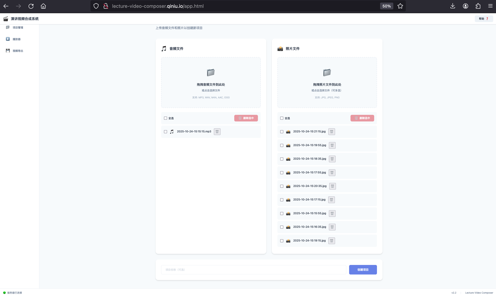
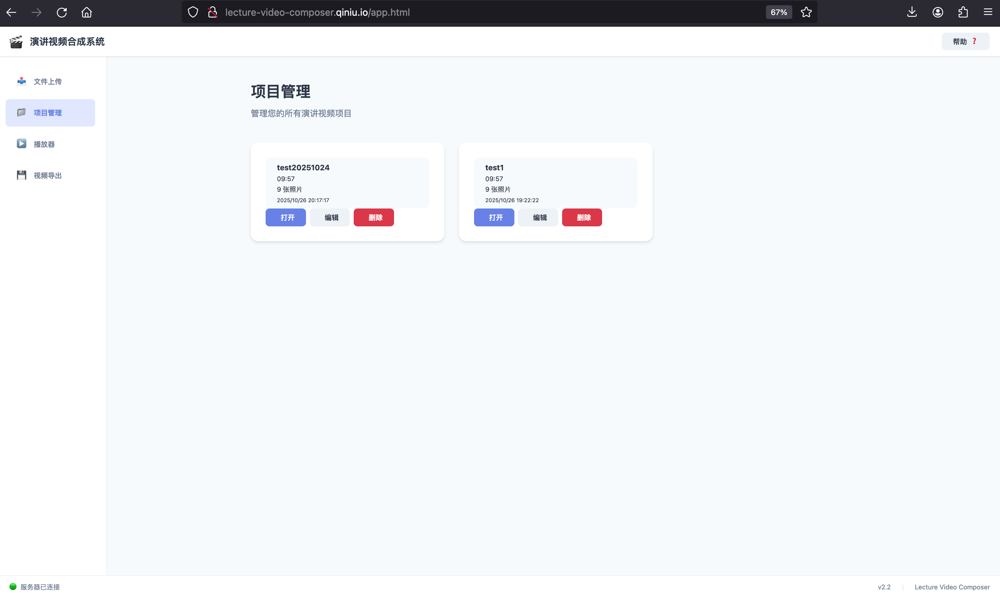
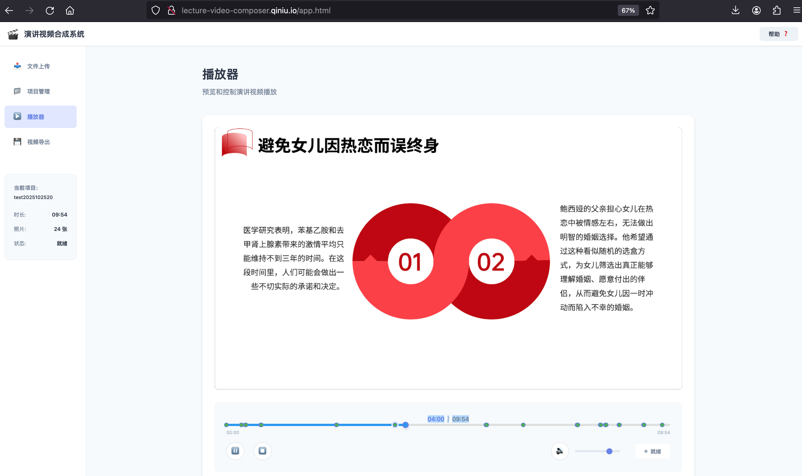

# 演讲视频合成系统

> 智能的演讲内容记录与回放工具，将音频与照片通过时间轴同步，生成流畅的演讲视频

[](https://github.com/Qiniu-ERE/Sunflower)
[](https://www.python.org/)
[](./LICENSE)

---

## ✨ 核心特性

- 🎯 **轻量化存储** - 相比传统录屏节省 80%+ 存储空间
- 🚀 **操作简便** - 只需录音+拍照，无需连续录像
- ⚡ **实时播放** - 基于时间轴的音画自动同步
- 🎬 **智能字幕** - AI 语音识别自动生成字幕
- 📦 **视频导出** - 支持 720p/1080p MP4 输出

---

## 🎬 效果展示

<!-- 演示视频 -->
### 📹 演示视频

> 待添加：系统操作演示视频


<!-- 界面截图 -->
### 🖼️ 界面预览

<table>
  <tr>
    <td><br/><center>文件上传</center></td>
    <td><br/><center>项目管理</center></td>
  </tr>
  <tr>
    <td><br/><center>实时播放</center></td>
    <td><br/><center>时间轴控制</center></td>
  </tr>
</table>

> 提示：截图将在完成 UI 调优后添加

---

## 🚀 快速开始

### 环境要求

- Python 3.8+
- 现代浏览器（Chrome/Firefox/Safari）

### 安装运行

```bash
# 1. 克隆项目
git clone https://github.com/Qiniu-ERE/Sunflower.git
cd Sunflower/lecture-video-composer

# 2. 安装依赖
pip install -r requirements.txt

# 3. 启动 Web 服务
python run_web.py

# 4. 访问应用
# 浏览器打开：http://127.0.0.1:5000
```

### 基本使用

1. **上传文件** - 拖拽音频（MP3/WAV）和照片（JPG/PNG）到上传区
2. **创建项目** - 系统自动解析时间戳并生成时间轴
3. **播放预览** - 实时同步播放音频和照片切换
4. **导出视频** - 配置参数并导出 MP4 视频（开发中）

> **文件命名规范**：`YYYY-MM-DD-HH:MM:SS.扩展名`（如：`2025-10-24-15:30:45.jpg`）

---

## 📦 项目结构

```
lecture-video-composer/
├── src/
│   ├── core/                    # 核心引擎
│   │   ├── lecture_composer.py  # 主合成器
│   │   ├── player/              # 播放器模块 ✅
│   │   └── timeline/            # 时间轴引擎 ✅
│   ├── web/                     # Web 应用 ✅
│   │   ├── app.py               # Flask 主应用
│   │   ├── api/                 # REST API
│   │   ├── static/              # 前端资源
│   │   └── services/            # 业务服务
│   └── services/                # 功能服务
│       ├── audio/               # 音频处理 ✅
│       ├── video/               # 视频导出 ✅
│       ├── subtitle/            # 字幕生成 ✅
│       └── image/               # 图片处理 ✅
├── tests/                       # 单元测试 ✅
├── docs/                        # 项目文档
└── examples/                    # 使用示例
```

---

## 📊 开发进度

### v2.2 - Web 界面版本（当前版本）

**已完成功能** ✅

- [x] **后端架构**（Day 1-3）
  - Flask Web 服务器
  - 文件上传/管理 API
  - 项目管理 API
  - 播放控制 API
  - 会话管理系统

- [x] **前端界面**（Day 2-3）
  - 响应式 Web UI（4 个主视图）
  - 文件拖拽上传（支持批量）
  - 实时播放器（Canvas 渲染）
  - 时间轴可视化组件
  - 状态管理和持久化

- [x] **核心功能**
  - 音频播放控制
  - 照片自动切换（3 种过渡动画）
  - 时间轴精确同步
  - 键盘快捷键支持

**开发中功能** 🚧

- [ ] **视频导出**（Day 3）
  - 后台任务管理
  - 导出进度追踪
  - 多分辨率支持

- [ ] **功能完善**（Day 1-3）
  - 用户文档编写
  - API 文档完善
  - 性能优化

**测试覆盖** 📝

- 后端单元测试：26/26 通过 ✅
- 前端集成测试：核心流程验证完成 ✅
- 已修复主要 Bug：5 个 ✅

### 历史版本

- **v2.1** - 播放器核心模块（2025-10）
- **v2.0** - 智能字幕生成（2025-09）
- **v1.0** - 基础 MVP 版本（2025-08）

---

## 📚 文档

### 用户文档
- [快速开始指南](./docs/快速开始.md)
- [使用教程](./docs/使用教程.md)
- [常见问题](./docs/FAQ.md)

### 开发文档
- [产品需求文档（PRD）](../docs/PRD_演讲视频合成系统.md)
- [技术架构设计](./docs/architecture/README.md)
- [实施计划](../docs/implementation_plan.md)
- [Web API 文档](./docs/api/Web_API文档.md)

### 功能模块文档
- [播放器模块](./docs/development/播放器模块文档.md)
- [视频导出模块](./docs/development/视频导出模块文档.md)
- [字幕功能](./docs/development/字幕功能文档.md)
- [时间轴同步](./docs/development/时间轴同步文档.md)

### 更新日志
- [v2.2 更新说明](./docs/changelog/v2.2_项目状态与规划更新.md)
- [v2.1 更新说明](./docs/changelog/v2.1_更新说明.md)
- [v2.0 更新说明](./docs/changelog/v2.0_更新说明.md)

---

## 🛠️ 技术栈

### 后端
- **Python 3.8+** - 主要编程语言
- **Flask** - Web 框架
- **Pillow** - 图像处理
- **MoviePy** - 视频合成
- **Whisper** - 语音识别（字幕生成）

### 前端
- **原生 JavaScript（ES6+）** - 无框架依赖
- **HTML5 Canvas** - 照片渲染
- **Web Audio API** - 音频播放
- **CSS3** - 响应式样式

### 开发工具
- **pytest** - 单元测试
- **Git** - 版本控制

---

## 🤝 贡献

我们欢迎各种形式的贡献！

- 🐛 [报告 Bug](https://github.com/Qiniu-ERE/Sunflower/issues)
- 💡 [提出功能建议](https://github.com/Qiniu-ERE/Sunflower/issues)
- 📝 改进文档
- 🔧 提交代码

---

## 📄 许可证

本项目采用 [MIT 许可证](./LICENSE)

---

## 📧 联系方式

- GitHub: [@Qiniu-ERE](https://github.com/Qiniu-ERE)
- Issues: [提交问题](https://github.com/Qiniu-ERE/Sunflower/issues)
- Email: Qiniu-ERE@gmail.com

---

<p align="center">
  <b>Made with ❤️ by Sunflower Team</b><br>
  <sub>基于 AI 辅助开发，快速迭代，持续改进</sub>
</p>
