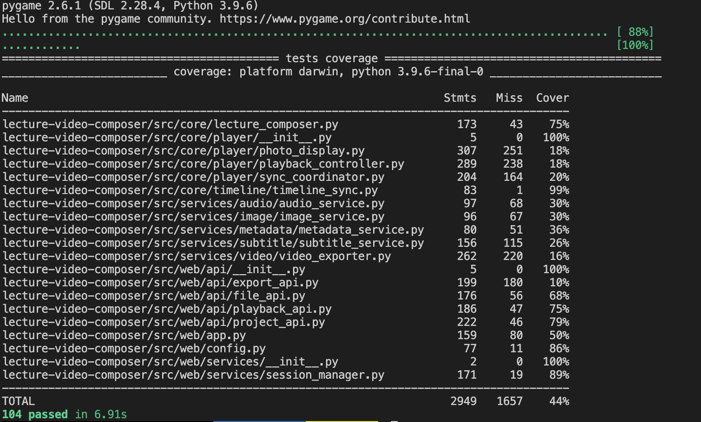

# 快速测试指南

> v3.0.0 GA版本 - 完整测试指南

---

## 📊 当前测试状态

**版本**: v3.0.0 GA  
**测试总数**: **104项** ✅  
**通过率**: **100%** (104/104)  
**总体覆盖率**: **44%**


*所有104项测试全部通过*

---

## 🚀 快速开始

### 1. 安装依赖

```bash
cd lecture-video-composer

# 安装基础依赖
pip install -r requirements.txt

# 注意：字幕功能需要安装 Whisper（可选）
pip install openai-whisper
```

### 2. 运行所有测试

```bash
# 运行所有测试（推荐）
python3 -m pytest tests/ -v

# 查看测试覆盖率
python3 -m pytest tests/ --cov=src --cov-report=html
```

### 3. 运行特定测试

```bash
# 只运行Web API测试
python3 -m pytest tests/web/ -v

# 只运行核心模块测试
python3 -m pytest tests/unit/core/ -v

# 只运行时间轴测试
python3 -m pytest tests/unit/core/timeline/ -v
```

---

## 📋 测试模块说明

### 核心模块测试（52项）

#### 1. LectureComposer 测试（22项）
- ✅ 初始化和验证
- ✅ 元数据提取
- ✅ 时间轴构建
- ✅ 项目保存
- ✅ 视频导出

**运行命令**:
```bash
python3 -m pytest tests/unit/core/test_lecture_composer.py -v
```

#### 2. Timeline 测试（30项）
- ✅ Timeline和TimelineItem类
- ✅ 时间戳解析（多种格式）
- ✅ 文件验证
- ✅ 边界条件测试

**运行命令**:
```bash
python3 -m pytest tests/unit/core/timeline/test_timeline_sync.py -v
```

### Web API 测试（52项）

#### 1. 文件API测试（12项）
- ✅ 音频上传
- ✅ 照片上传
- ✅ 文件列表
- ✅ 文件删除

#### 2. 项目API测试（20项）
- ✅ 项目创建
- ✅ 项目列表
- ✅ 项目详情
- ✅ 项目删除

#### 3. 播放API测试（15项）
- ✅ 播放控制
- ✅ 状态管理
- ✅ 时间跳转

#### 4. 会话测试（5项）
- ✅ 会话创建
- ✅ 会话隔离
- ✅ 会话清理

**运行命令**:
```bash
python3 -m pytest tests/web/ -v
```

---

## 💡 推荐测试流程

### 方案A: 快速验证（推荐新用户）✅

```bash
# 1. 运行所有自动化测试（约1-2分钟）
python3 -m pytest tests/ -v

# 2. 查看测试结果
# 应该看到 104 passed 的提示
```

### 方案B: 详细测试（推荐开发者）✅

```bash
# 1. 运行测试并生成覆盖率报告
python3 -m pytest tests/ -v --cov=src --cov-report=html

# 2. 查看覆盖率报告
open htmlcov/index.html  # macOS
# start htmlcov/index.html  # Windows
# xdg-open htmlcov/index.html  # Linux
```

### 方案C: 功能演示测试（可选）

```bash
# 测试v2.0功能（视频导出和字幕）
python3 examples/basic/test_v2_features.py

# 当询问是否测试字幕视频时，根据需要选择
# 当询问是否对比分辨率时，根据需要选择
```

### 方案D: 单独测试某个模块

```bash
# 只测试核心模块
python3 -m pytest tests/unit/core/ -v

# 只测试Web API
python3 -m pytest tests/web/ -v

# 只测试特定文件
python3 -m pytest tests/unit/core/test_lecture_composer.py -v
```

---

## 📁 查看测试结果

### 输出文件位置

```
examples/output/v2_test/
├── video_720p.mp4                    # 720p视频（无字幕）
├── video_720p_with_subtitles.mp4     # 720p视频（带字幕）
├── video_1080p.mp4                   # 1080p视频（对比用）
├── video_720p_compare.mp4            # 720p视频（对比用）
├── metadata.json                     # 项目元数据
├── subtitles/                        # 字幕文件
│   ├── 2025-10-24-15:15:15.srt      # SRT格式字幕
│   └── 2025-10-24-15:15:15.ass      # ASS格式字幕
├── audio/                            # 音频文件
└── photos/                           # 照片文件
```

### 播放视频

**推荐播放器**:
- **VLC Media Player** - 全平台，最佳兼容性
- **MPC-HC** - Windows平台
- **IINA** - macOS平台
- **mpv** - Linux平台

**播放命令**:
```bash
# macOS
open examples/output/v2_test/video_720p.mp4

# Windows
start examples/output/v2_test/video_720p.mp4

# Linux
xdg-open examples/output/v2_test/video_720p.mp4

# 使用VLC
vlc examples/output/v2_test/video_720p_with_subtitles.mp4
```

---

## 🔍 验证要点

### 1. 视频质量检查

- [ ] 视频能够正常播放
- [ ] 分辨率为1280x720
- [ ] 照片清晰，无失真
- [ ] 照片切换流畅
- [ ] 音频同步正确

### 2. 字幕检查

- [ ] 字幕文件正确生成（SRT和ASS）
- [ ] 字幕内容与音频匹配
- [ ] 字幕时间轴准确
- [ ] 字幕在视频中正确显示
- [ ] 字幕位置和样式合适

### 3. 性能检查

- [ ] 720p文件比1080p小约40%
- [ ] 视频质量在可接受范围内
- [ ] 处理速度在合理范围内

---

## ❓ 常见问题

### Q1: Whisper安装失败

**问题**: `pip install openai-whisper` 失败

**解决**:
```bash
# 方法1: 升级pip
pip install --upgrade pip
pip install openai-whisper

# 方法2: 使用清华源
pip install -i https://pypi.tuna.tsinghua.edu.cn/simple openai-whisper

# 方法3: 使用conda
conda install -c conda-forge openai-whisper
```

### Q2: 首次运行很慢

**原因**: Whisper首次运行需要下载模型文件（约100MB）

**解决**: 
- 确保网络连接稳定
- 耐心等待模型下载完成
- 后续运行会使用缓存的模型，速度会快很多

### Q3: 字幕识别不准确

**原因**: 使用的模型太小或音频质量不好

**解决**:
```bash
# 使用更大的模型
python src/services/subtitle/subtitle_service.py \
    examples/fixtures/audio.mp3 \
    --model medium \
    --language zh
```

### Q4: 视频播放器不显示字幕

**原因**: 字幕已嵌入视频，但播放器可能不支持

**解决**:
- 使用VLC等标准播放器
- 检查字幕是否正确嵌入
- 查看SRT文件确认字幕内容正确

### Q5: 测试数据不存在

**问题**: 提示音频或照片文件不存在

**解决**:
```bash
# 检查测试数据
ls -la examples/fixtures/
ls -la examples/fixtures/sample-photos/

# 如果不存在，需要准备测试数据
# 音频文件命名格式: YYYY-MM-DD-HH:MM:SS.mp3
# 照片文件命名格式: YYYY-MM-DD-HH:MM:SS.jpg
```

---

## 🎯 性能基准

### 自动化测试性能

| 测试类型 | 测试数量 | 预期耗时 | 实际表现 |
|---------|---------|---------|---------|
| 单元测试 | 52项 | < 5秒 | ✅ 快速 |
| Web API测试 | 52项 | < 10秒 | ✅ 快速 |
| 总计 | 104项 | < 15秒 | ✅ 优秀 |

### 功能测试性能

以10分钟演讲（10张照片）为例：

| 测试项 | 预期结果 |
|--------|---------|
| 720p视频导出 | 2-3分钟 |
| 字幕生成（base模型） | 2-5分钟 |
| 字幕嵌入 | 1-2分钟 |
| 720p文件大小 | 30-50MB |
| 1080p文件大小 | 60-80MB |
| 大小减少比例 | 35-45% |

**注意**: 实际性能取决于：
- CPU性能
- 是否使用GPU加速
- 音频时长
- 照片数量和大小

---

## 📞 获取帮助

如果遇到问题：

1. 查看详细错误信息
2. 检查日志输出
3. 参考文档:
   - [视频导出模块文档](../development/视频导出模块文档.md)
   - [字幕功能文档](../development/字幕功能文档.md)
   - [v2.0更新说明](../changelog/v2.0_更新说明.md)
4. 提交Issue到GitHub

---

## ✅ 测试清单

完成测试后，请确认：

- [ ] 成功安装所有依赖
- [ ] 所有104项测试通过 ✅
- [ ] 核心模块测试覆盖率达标（75%+）
- [ ] Web API测试全部通过
- [ ] 了解如何运行和查看测试
- [ ] 查看了测试覆盖率报告
- [ ] 了解如何添加新测试

---

## 📚 相关文档

- [集成测试指南](./集成测试指南.md) - 详细的集成测试说明
- [测试覆盖率分析报告](./测试覆盖率分析报告.md) - 完整的覆盖率分析
- [v3.0.0 GA版本发布](../changelog/v3.0.0_GA版本发布.md) - 版本更新说明

---

**祝测试顺利！** 🎉

<p align="center">
  <sub>最后更新：2025-10-29</sub>
</p>
